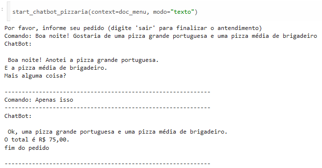
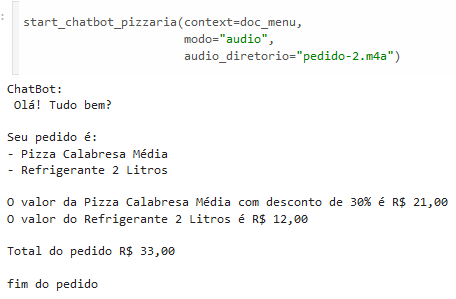
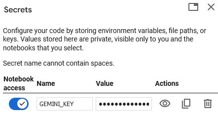

# ChatBot Pizzaria Super Legal 🍕😊👍

👁👁 **Escopo:** Este projeto é parte do **desafio proposto** pela **Alura** com parceria com o **Google** na **Segunda Edição da Imersão de IA**.

O **ChatBot Pizzaria Super Legal** 🍕😊👍 é um ChatBot que irá auxiliar o atendente a fazer um resumo dos pedidos realizado por clientes da pizzaria, agilizando o processo como todo. Para isso conta com um sistema de texto e áudio, onde é possível fornecer um áudio informando seu pedido e a IA irá traduzir para texto e enviar para o atendente.

---

## Texto

---

## Áudio

# 🛠 Configuração

1. Obtenha usa API KEY do Google Gemini e adicione como Secrets no Google Colab:

Note: tutorial ensinando como gerar &rarr; [https://www.geminiforwork.com/setup-api-keys/create-geminiai-api-key/](https://www.geminiforwork.com/setup-api-keys/create-geminiai-api-key/)

2. Abra o Jupyter Notebook: [ChatBot_Pizzaria_Super_Legal.ipynb](https://github.com/BrenoAV/ChatBot_Pizzaria_Super_Legal/blob/main/ChatBot_Pizzaria_Super_Legal.ipynb) e execute no Colab.

3. Nada mais!!!

---

🛠️ Created by <strong>BrenoAV<strong> 🚀

